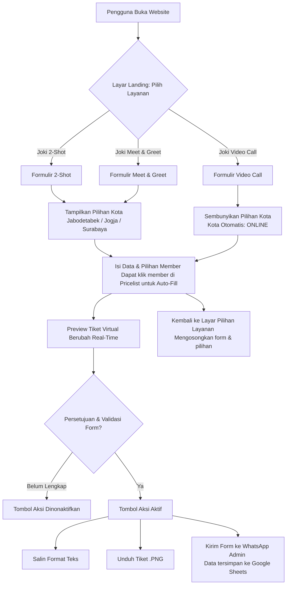

# JokJoker48 - Premium JKT48 2-Shot Jockey Service Form

Formulir web premium interaktif untuk Jasa Joki 2-Shot JKT48 bernama **"JokJoker48"**. Website ini dirancang dengan estetika modern bertema *dark chocolate* (cokelat gelap) dan aksen emas hangat (*gold*), serta dilengkapi berbagai fitur otomatisasi untuk mempermudah pemesanan jasa joki.

## 🌟 Fitur Utama

1. **Aestetika Premium & Responsif**:
   - Skema warna cokelat gelap (`#120804`), emas hangat (`#d4af37`), dan krem lembut.
   - Desain modern menggunakan efek *glassmorphism* transparan.
   - Responsif dan ramah seluler (mobile-friendly).

2. **Pricelist Joki Interaktif**:
   - Menampilkan daftar harga member JKT48 berdasarkan kategori Team (**Love**, **Dream**, **Passion**, dan **Trainee**).
   - Dilengkapi fitur pencarian member secara real-time dan penyaringan tab tim.
   - **Fitur Auto-Fill Bertingkat (Cascading)**: Cukup klik nama member di daftar harga untuk mengisi kolom pilihan joki prioritas/cadangan secara otomatis.

3. **Pratinjau Tiket Virtual (Live Ticket Generator)**:
   - Membuat pratinjau tiket konser/joki virtual secara real-time berdasarkan input formulir.
   - **Unduh Tiket (.PNG)**: Pengguna dapat mengunduh tiket joki virtual beresolusi tinggi langsung dari browser.

4. **Integrasi Google Sheets & WhatsApp**:
   - **Auto-Save Google Sheets**: Mengirimkan data pemesanan secara aman ke Google Spreadsheet admin via Google Apps Script Web App.
   - **Kirim ke WhatsApp**: Mengalihkan detail pesanan secara terstruktur langsung ke chat WhatsApp Admin.

---

## 🔄 Alur Pengguna (UX Flow)

Berikut adalah diagram alur pengalaman pengguna (user experience flow) dalam menggunakan web form pemesanan JokJoker48:



### Rincian Alur UX:
1. **Layar Landing (Layanan Joki)**: Pengguna memilih salah satu dari 3 jasa joki: **2-Shot**, **Meet & Greet**, atau **Video Call**.
2. **Kondisional Kota**: Pada pemesanan *2-Shot* & *Meet & Greet*, form menampilkan dropdown kota (**Jabodetabek**, **Jogja**, dan **Surabaya**). Untuk *Video Call* (layanan virtual), kolom kota otomatis disembunyikan dan diatur ke `"ONLINE"`.
3. **Pencarian & Auto-fill**: Pengguna bisa mencari nama member dan mengkliknya pada tabel pricelist dinamis untuk mengisi kolom Prioritas & Cadangan secara otomatis (bertumpuk).
4. **Validasi & Aksi**: Tombol salin teks, unduh tiket, dan kirim WhatsApp hanya akan aktif setelah pengguna mencentang checkbox persetujuan ketentuan dan melengkapi data form.

---

## 🛠️ Panduan Konfigurasi Google Sheets

Agar form dapat mengirimkan data otomatis ke Google Spreadsheet Anda sebelum mengalihkan ke WhatsApp, ikuti langkah-langkah penyiapan di bawah ini:

### 1. Salin Kode Google Apps Script (`Code.gs`)
Buka Google Spreadsheet Anda, klik menu **Extensions (Ekstensi)** -> **Apps Script**, hapus semua kode bawaan lalu tempel kode berikut:

```javascript
function doPost(e) {
  var sheet = SpreadsheetApp.getActiveSpreadsheet().getSheetByName("Book 2s theater sementara (Responses)") || 
              SpreadsheetApp.getActiveSpreadsheet().getSheetByName("Form Responses 1") || 
              SpreadsheetApp.getActiveSpreadsheet().getActiveSheet();
  
  var data;
  try {
    data = JSON.parse(e.postData.contents);
  } catch(err) {
    data = e.parameter;
  }
  
  var headers = sheet.getRange(1, 1, 1, sheet.getLastColumn()).getValues()[0];
  var rowData = new Array(headers.length);
  
  var fieldMapping = {
    "Timestamp": new Date(),
    "Email address": data.personalEmail || "",
    "Sudah membaca deskripsi diatas?": data.agree || "Sudah",
    "Tipe akun": data.accountType || "",
    "Nama": data.userName || "",
    "Kota": data.city || "",
    "Email Akun JKT48 Pastikan diisi dengan benar !": data.jkt48Email || "",
    "Password Akun JKT48 Pastikan diisi dengan benar !": data.jkt48Password || "",
    "Nomor WhatsApp Aktif (Untuk Dihubungi)": data.whatsapp || "",
    "2Shot Prioritas NAMA LENGKAP MEMBER - TEAM": data.priorities || "",
    "2Shot Cadangan (kalau prioritas habis) NAMA LENGKAP MEMBER - TEAM": data.backups || "",
    "Penjoko": "",
    "Keterangan": data.keterangan || ""
  };
  
  for (var i = 0; i < headers.length; i++) {
    var header = headers[i].trim();
    var matchedValue = "";
    for (var key in fieldMapping) {
      if (header.toLowerCase().indexOf(key.toLowerCase()) !== -1) {
        matchedValue = fieldMapping[key];
        break;
      }
    }
    rowData[i] = matchedValue !== "" ? matchedValue : "";
  }
  
  if (headers.length === 0 || (headers.length === 1 && headers[0] === "")) {
    rowData = [
      new Date(),
      data.personalEmail || "",
      data.agree || "Sudah",
      data.accountType || "",
      data.userName || "",
      data.city || "",
      data.jkt48Email || "",
      data.jkt48Password || "",
      data.whatsapp || "",
      data.priorities || "",
      data.backups || "",
      "",
      ""
    ];
  }
  
  sheet.appendRow(rowData);
  
  return ContentService.createTextOutput(JSON.stringify({ "result": "success" }))
                       .setMimeType(ContentService.MimeType.JSON)
                       .setHeader("Access-Control-Allow-Origin", "*");
}

function doGet(e) {
  return ContentService.createTextOutput("Script running successfully. Use POST method to submit data.");
}
```

### 2. Deploy sebagai Web App
1. Klik tombol **Save** (ikon disket) di atas editor.
2. Klik tombol **Deploy** di kanan atas -> Pilih **New deployment**.
3. Pilih tipe deployment dengan klik ikon gerigi -> Pilih **Web app**.
4. Set konfigurasi berikut:
   - **Execute as**: Pilih `Me (email-anda@gmail.com)`
   - **Who has access**: Pilih **`Anyone`** (agar server menerima request dari website).
5. Klik **Deploy**.
6. Setujui perizinan akun (pilih akun Google Anda -> klik *Advanced* -> klik *Go to Untitled project* -> klik *Allow*).
7. Salin **Web App URL** yang diberikan (URL berakhiran `/exec`).

### 3. Konfigurasi di Web Form
1. Buka file `app.js`.
2. Pada baris ke-66, cari variabel `GOOGLE_SHEET_SCRIPT_URL` dan tempelkan URL yang sudah disalin:
   ```javascript
   const GOOGLE_SHEET_SCRIPT_URL = "https://script.google.com/macros/s/xxxx/exec";
   ```
3. Simpan perubahan file.

---

## 📂 Struktur File

- `index.html` — Struktur layout halaman web, formulir pemesanan, dan pratinjau tiket.
- `style.css` — Styling visual premium bertema cokelat-emas dan glassmorphism.
- `app.js` — Logika interaktif form, filter pencarian pricelist, pembuat tiket dengan HTML5 Canvas, serta request HTTP POST ke Google Sheets.
- `.gitignore` — Konfigurasi Git untuk mengabaikan berkas sistem dan log sementara.

---

## 💻 Cara Menjalankan Lokal

1. Clone repositori ini:
   ```bash
   git clone https://github.com/Emzyjeppp/jokjoker48-form.git
   ```
2. Masuk ke direktori proyek:
   ```bash
   cd jokjoker48-form
   ```
3. Klik dua kali file `index.html` untuk membukanya di browser secara langsung, atau jalankan menggunakan server lokal (seperti Live Server di VS Code atau perintah `npx http-server`).
